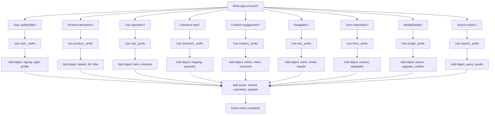

## Why Event Naming Matters

Inconsistent event names make your analytics confusing and hard to query. Imagine trying to find all signup-related events when they're named:
- `signup_clicked`
- `button_signup_click`
- `user_registered`
- `sign_up_button`

A systematic naming convention solves this by making events:
- **Clear**: Anyone can understand what happened
- **Consistent**: Similar actions follow the same pattern
- **Queryable**: Easy to filter and group on the backend

## The Convention: Hierarchical Naming

Use this format for custom events:

```
{category}_{object}_{action}
```

**Example**: `user_signup_clicked`
- **Category**: `user_` (what domain)
- **Object**: `signup` (what thing)
- **Action**: `clicked` (what happened)

This hierarchical structure enables powerful wildcard queries:
- All user events: `user_*`
- All signup actions: `*_signup_*`
- All clicks: `*_clicked`

## Categories

Choose the category that best describes the domain of the event:

| Category | Use For | Examples |
|----------|---------|----------|
| `user_` | Authentication, profile, settings, account actions | `user_signup_clicked`, `user_profile_updated` |
| `product_` | Product browsing, filtering, comparisons | `product_details_viewed`, `product_filter_applied` |
| `cart_` | Shopping cart operations | `cart_item_added`, `cart_checkout_started` |
| `checkout_` | Checkout flow steps | `checkout_payment_submitted`, `checkout_address_updated` |
| `content_` | Content engagement (articles, videos, docs) | `content_article_viewed`, `content_video_played` |
| `nav_` | Navigation actions | `nav_menu_opened`, `nav_footer_clicked` |
| `form_` | Form interactions | `form_contact_submitted`, `form_newsletter_signed` |
| `modal_` | Modal/dialog interactions | `modal_promo_closed`, `modal_signup_opened` |
| `search_` | Search activities | `search_query_submitted`, `search_results_filtered` |

<Tip>
**Can't find the right category?** Use the most specific domain that fits. For edge cases, prioritize clarity over perfect categorization.
</Tip>

## Actions

Use standard action verbs that clearly indicate what happened:

### Interaction Actions
- `clicked` - User clicked/tapped an element
- `submitted` - User submitted a form
- `opened` - User opened a modal, menu, or expandable
- `closed` - User closed a modal, menu, or expandable
- `toggled` - User toggled a switch or option

### CRUD Actions
- `added` - Item added to collection
- `removed` - Item removed from collection
- `updated` - Item modified
- `deleted` - Item permanently removed

### Progress Actions
- `started` - User began a process
- `completed` - User finished a process
- `failed` - Action failed
- `cancelled` - User cancelled an action

### View Actions
- `viewed` - User saw a page or section
- `scrolled` - User scrolled to a section
- `hovered` - User hovered over an element

## Complete Examples

### E-commerce Site

```typescript
// User authentication
grain.track('user_signup_clicked');
grain.track('user_login_submitted', { method: 'google' });
grain.track('user_logout_clicked');

// Product browsing
grain.track('product_list_viewed', { category: 'shoes' });
grain.track('product_details_viewed', { product_id: 'SKU123' });
grain.track('product_image_clicked', { image_index: 2 });

// Shopping cart
grain.track('cart_item_added', { product_id: 'SKU123', quantity: 1 });
grain.track('cart_item_removed', { product_id: 'SKU456' });
grain.track('cart_checkout_started');

// Checkout flow
grain.track('checkout_shipping_updated', { method: 'express' });
grain.track('checkout_payment_submitted', { method: 'credit_card' });
grain.track('checkout_completed', { order_id: 'ORD-789', total: 99.99 });
grain.track('checkout_failed', { error: 'payment_declined' });
```

### SaaS Platform

```typescript
// User onboarding
grain.track('user_signup_started');
grain.track('user_email_verified');
grain.track('user_onboarding_completed');

// Feature usage
grain.track('content_dashboard_viewed');
grain.track('nav_settings_clicked');
grain.track('form_profile_updated', { fields: ['name', 'avatar'] });

// Modals and CTAs
grain.track('modal_upgrade_opened');
grain.track('modal_upgrade_closed', { action: 'dismissed' });
grain.track('nav_pricing_clicked', { source: 'header' });
```

### Content Site

```typescript
// Content engagement
grain.track('content_article_viewed', { article_id: 'post-123' });
grain.track('content_video_played', { video_id: 'vid-456', position: '30%' });
grain.track('content_comment_submitted');

// Search and discovery
grain.track('search_query_submitted', { query: 'react hooks', results: 42 });
grain.track('search_results_filtered', { filter: 'recent' });
grain.track('nav_category_clicked', { category: 'tutorials' });

// Newsletter and shares
grain.track('form_newsletter_submitted', { source: 'article_footer' });
grain.track('content_share_clicked', { platform: 'twitter' });
```

## Quick Reference Decision Tree



## Integration with Template Events

**Template events** (provided by the SDK) use simple names and should NOT be renamed:

<CodeGroup>
```typescript Template Events (Keep as-is)
// These are fine - they're SDK templates
grain.track('login', { method: 'google' });
grain.track('signup', { plan: 'pro' });
grain.track('purchase', { order_id: '123', total: 99.99 });
grain.track('checkout', { step: 'payment' });
```

```typescript Custom Events (Use convention)
// Your custom events should follow the convention
grain.track('user_profile_photo_uploaded');
grain.track('cart_coupon_applied', { code: 'SAVE10' });
grain.track('checkout_gift_message_added');
```
</CodeGroup>

**System events** (starting with `_grain_`) are internal and managed by the SDK:
- `_grain_session_start`
- `_grain_session_end`
- `_grain_heartbeat`
- `_grain_consent_granted`

<Warning>
Never create custom events starting with `_grain_` - this prefix is reserved for internal SDK events.
</Warning>

## Query Benefits

The hierarchical naming convention makes your analytics more organized and discoverable:

### Event Discovery

When you list all events in your dashboard, hierarchical names group logically:

```typescript
// GET /v1/api/query/events/{tenantId}
// Returns organized event list:

[
  "cart_checkout_started",
  "cart_item_added",
  "cart_item_removed",
  "checkout_completed",
  "checkout_payment_failed",
  "checkout_payment_submitted",
  "checkout_shipping_updated",
  "user_login_clicked",
  "user_profile_updated",
  "user_signup_clicked"
]
```

Events naturally sort alphabetically by category, making it easy to find related events.

### Query Specific Events

Query individual events with clear, descriptive names:

```typescript
// Query all cart additions
const response = await fetch('https://api.grainql.com/v1/api/query/your-tenant-id', {
  method: 'POST',
  headers: {
    'Content-Type': 'application/json',
    'X-API-Key': process.env.GRAIN_API_KEY
  },
  body: JSON.stringify({
    event: 'cart_item_added',
    after: '2024-01-01',
    before: '2024-01-31'
  })
});
```

### Build Conversion Funnels

Create clear, logical funnels with consistent naming:

```typescript
const checkoutFunnel = [
  'product_details_viewed',
  'cart_item_added',
  'cart_checkout_started',
  'checkout_shipping_updated',
  'checkout_payment_submitted',
  'checkout_completed'
];

// Query each step
for (const step of checkoutFunnel) {
  const count = await fetch(`https://api.grainql.com/v1/api/query/count/${tenantId}`, {
    method: 'POST',
    headers: { 'X-API-Key': apiKey, 'Content-Type': 'application/json' },
    body: JSON.stringify({ event: step, after: '2024-01-01' })
  });
  console.log(`${step}: ${count.count} users`);
}
```

### Dashboard Organization

Group related events in your analytics dashboard:

```typescript
// All user authentication events
const authEvents = [
  'user_signup_clicked',
  'user_login_clicked',
  'user_logout_clicked'
];

// All product browsing events
const browsingEvents = [
  'product_list_viewed',
  'product_details_viewed',
  'product_filter_applied'
];

// All form events
const formEvents = [
  'form_contact_submitted',
  'form_newsletter_signed',
  'form_survey_completed'
];
```

### Filter Event Lists

When displaying events in UI, the hierarchical structure helps filter by category:

```typescript
// Get all events
const allEvents = await fetch(`https://api.grainql.com/v1/api/query/events/${tenantId}`, {
  headers: { 'X-API-Key': apiKey }
}).then(r => r.json());

// Filter by category in your UI
const userEvents = allEvents.filter(e => e.startsWith('user_'));
const cartEvents = allEvents.filter(e => e.startsWith('cart_'));
const checkoutEvents = allEvents.filter(e => e.startsWith('checkout_'));

// Display in categorized dropdown
<select>
  <optgroup label="User Events">
    {userEvents.map(e => <option>{e}</option>)}
  </optgroup>
  <optgroup label="Cart Events">
    {cartEvents.map(e => <option>{e}</option>)}
  </optgroup>
</select>
```

## Common Patterns

### Multi-step Flows

For processes with multiple steps, use consistent object names:

```typescript
// Signup flow
grain.track('user_signup_started');
grain.track('user_signup_email_entered');
grain.track('user_signup_password_created');
grain.track('user_signup_completed');

// Checkout flow
grain.track('checkout_started');
grain.track('checkout_shipping_entered');
grain.track('checkout_payment_entered');
grain.track('checkout_completed');
```

### Errors and Failures

Include failure states for debugging:

```typescript
grain.track('form_contact_submitted');
grain.track('form_contact_failed', { error: 'invalid_email' });

grain.track('checkout_payment_submitted');
grain.track('checkout_payment_failed', { error: 'card_declined' });
```

### CTA Tracking

Track calls-to-action with their location context:

```typescript
// Include where the CTA appeared
grain.track('user_signup_clicked', { source: 'hero_banner' });
grain.track('user_signup_clicked', { source: 'pricing_page' });
grain.track('modal_upgrade_opened', { trigger: 'feature_limit_reached' });
```

### A/B Testing

Include variant information:

```typescript
grain.track('modal_promo_viewed', { 
  variant: 'control',
  experiment: 'summer_sale_2024'
});

grain.track('user_signup_clicked', {
  variant: 'test_b',
  experiment: 'cta_color_test'
});
```

## Migration Guide

### Adopting the Convention

If you have existing events with different naming:

1. **Map old events to new convention**:
   ```typescript
   // Old event name → New event name
   button_clicked → user_signup_clicked (if it's signup button)
   view_product → product_details_viewed
   add_cart → cart_item_added
   ```

2. **Track both during transition**:
   ```typescript
   // Track both old and new event names temporarily
   grain.track('button_clicked', properties); // Legacy
   grain.track('user_signup_clicked', properties); // New convention
   ```

3. **Update queries and dashboards** to use new event names

4. **Deprecate old events** after migration period (30-90 days)

### Backward Compatibility

The SDK supports all event names, so existing events continue to work. Migrate at your own pace:

- **Option 1**: Migrate all at once (small codebases)
- **Option 2**: Migrate feature-by-feature (large codebases)
- **Option 3**: New events use convention, legacy events remain

<Tip>
Use the Query API's event list endpoint to audit your current event names and plan your migration strategy.
</Tip>

## Edge Cases

### When the Convention Doesn't Fit

The convention covers 90% of use cases, but when it doesn't fit:

**Option 1 - Be specific with object**:
```typescript
// Instead of inventing a new category
grain.track('user_referral_link_copied'); // Still uses user_ category
grain.track('cart_wishlist_moved'); // Extends cart_ for wishlist
```

**Option 2 - Use descriptive custom name**:
```typescript
// For truly unique cases, clarity trumps convention
grain.track('easter_egg_discovered');
grain.track('konami_code_entered');
```

### Very Long Event Names

Keep names under 50 characters when possible. If a name is too long, abbreviate the object:

```typescript
// Too long (63 chars)
grain.track('checkout_shipping_address_autocomplete_selected');

// Better (42 chars)
grain.track('checkout_address_autocomplete_selected');
```

### Mobile App Events

The convention works for mobile apps too:

```typescript
// Mobile-specific events still follow the pattern
grain.track('user_push_notification_enabled');
grain.track('nav_tab_switched', { tab: 'profile' });
grain.track('content_image_zoomed');
```

## Best Practices Summary

<AccordionGroup>
  <Accordion title="✅ Do" icon="check">
    - Use `{category}_{object}_{action}` format for custom events
    - Choose the most specific category that fits
    - Use standard action verbs (`clicked`, `viewed`, `submitted`)
    - Include context in properties, not in the event name
    - Keep names under 50 characters
    - Use past tense for actions
    - Test event names in queries before deploying
  </Accordion>

  <Accordion title="❌ Don't" icon="x">
    - Don't rename template events (`login`, `signup`, `purchase`)
    - Don't create events starting with `_grain_`
    - Don't encode data in event names (`product_123_viewed` ❌)
    - Don't use ambiguous verbs (`process`, `handle`, `do`)
    - Don't mix naming styles in the same app
    - Don't create redundant events with slight variations
    - Don't include timestamps or IDs in event names
  </Accordion>
</AccordionGroup>

## Event Name Checklist

Before tracking a custom event, verify:

- [ ] Does it follow `{category}_{object}_{action}` format?
- [ ] Is the category from the standard list?
- [ ] Is the action verb clear and standard?
- [ ] Is the name under 50 characters?
- [ ] Does it avoid conflicts with template events?
- [ ] Will it group well with related events in queries?
- [ ] Can someone else understand it without context?

## Next Steps

<CardGroup cols={2}>
  <Card title="Event Properties" icon="list" href="/core/event-tracking">
    Learn what properties to include with events
  </Card>
  <Card title="Template Events" icon="clipboard-list" href="/core/template-events">
    Use pre-built events for common actions
  </Card>
  <Card title="Query API" icon="database" href="/guides/query-api">
    Query events using the naming convention
  </Card>
  <Card title="Examples" icon="code" href="/examples/ecommerce-store">
    See the convention in real applications
  </Card>
</CardGroup>

## Need Help?

Questions about event naming?

- Check existing events in your [Dashboard](https://grainql.com/dashboard)
- Review the [Event Properties Reference](/event-properties)
- Contact support: support@grainql.com

